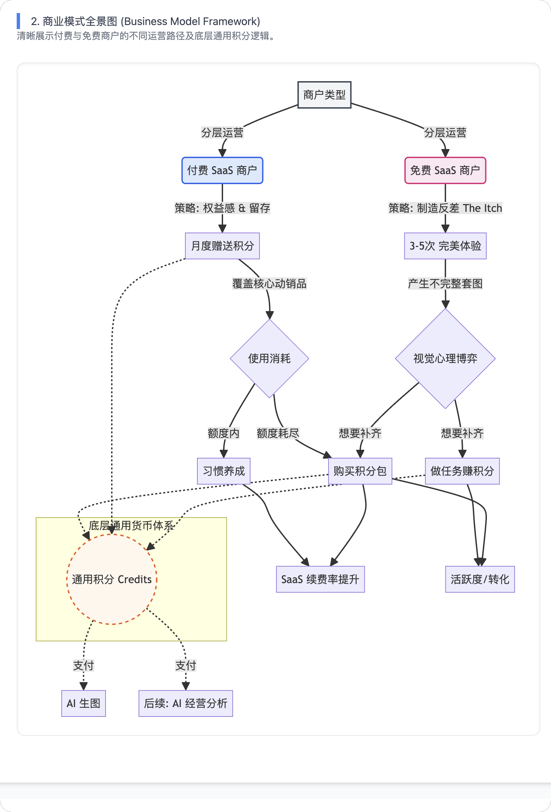

# AI 商品图商业化方案 (草案)

> **版本**: v1.0 (Top-down 视角重构)
> **日期**: 2025-12-18
> **核心导向**: 价值对齐 -> 分层运营 -> 体验闭环

## 1. 核心理念 (Core Philosophy)

**“不仅是好看，更是‘我的店’的升级版。”**

商业化的核心抓手不是“AI 技术”，而是**“超越预期的门店审美”**。

- **比原图更好**：美感必须显著高于商家自己手机拍摄的水平（解决“为什么要用”）。
- **比网图更像**：必须保留商家独特的门店/产品特征（解决“为什么敢用”）。
- **比找人更省**：在有限的尝试次数内，让商家感知到“省力”且“专业”。

## 2. 商业模式全景图 (Framework Visualization)



```mermaid
graph TD
    User[商户类型] -->|分层运营| PaidUser(付费 SaaS 商户)
    User -->|分层运营| FreeUser(免费 SaaS 商户)

    %% 付费商户路径
    PaidUser -->|策略: 权益感 & 留存| MonthlyGift[月度赠送积分]
    MonthlyGift -->|覆盖核心动销品| Usage{使用消耗}
    Usage -->|额度内| Loop[习惯养成]
    Usage -->|额度耗尽| BuyPacks[购买积分包]
    Loop --> Retention[SaaS 续费率提升]
    BuyPacks --> Retention

    %% 免费商户路径
    FreeUser -->|策略: 制造反差 (The Itch)| Trial[2-3次 尝鲜体验]
    Trial -->|产生不完整套图| Itch{视觉心理博弈}
    Itch -->|想要补齐| TaskReward[做任务赚积分]
    Itch -->|想要补齐| BuyPacks
    TaskReward --> Conversion[活跃度/转化]
    BuyPacks --> Conversion

    %% 底层支撑
    subgraph Infrastructure [底层通用货币体系]
        Credits((通用积分 Credits))
    end
    BuyPacks -.-> Credits
    MonthlyGift -.-> Credits
    TaskReward -.-> Credits
    Credits -.->|支付| AI_Image[AI 生图]
    Credits -.->|支付| AI_Analytics[后续: AI 经营分析]
```

## 3. 核心竞争壁垒 (Why not Doubao?)

**通用 AI (豆包/Kimi) vs. 垂直 SaaS (我们)**

- **数据上下文 (Context)**：
  - *豆包*：需要用户手打Prompt描述菜品（用户懒/不会写）。
  - *我们*：SaaS 已有菜品名、价格、分类标签。点击直接生成，Prompt 自动注入店铺专有信息（如“适合本店风格”）。
- **场景闭环 (Workflow)**：
  - *豆包*：生成 -> 保存 -> 打开SAAS后台 -> 找到菜品 -> 上传。路径断裂。
  - *我们*：生成 -> 满意 -> **一键应用**。路径最短。
- **结论**：我们卖的不是“图”，是**“省去了来回倒腾的时间”**。

## 3. 商业化模型设计 (Business Model)

采用 **“SaaS 内嵌 + 通用积分货币体系”**。
**积分 (Credits)** 定位为 SaaS 生态内的**通用货币**，不仅用于生图，未来可通用于“AI 经营日报”、“差评自动回复”、“选址分析”等所有 AI 增值服务。

### 3.1 付费 SaaS 商户 (价值：Retention & ARPU)

*既然已付费，不再进行二次强推销，而是强调“特权”。*

- **权益模式**：**积分制 (Credits)**。
- **机制设计**：
  - **额度逻辑**：
    - **覆盖核心动销**：假设普通小店月度核心主推/换新/活动品约为 10-15% SKU。
    - **建议值**：赠送 **50 积分/月**（按 20% 成功率，可完美产出 10 张图）。既覆盖了月度换新需求（如节庆活动页），又不会过剩导致积分贬值。
  - **过期清零**：积分当月有效，刺激商户每月活跃，养成习惯。
  - **超额付费**：超出赠送额度后，可单独购买积分包。
- **逻辑**：将生图作为 SaaS 的高价值“附赠品”，提升 SaaS 整体续费率。

### 3.2 免费 SaaS 商户 (价值：Activation & Conversion)

*价格敏感，主打“制造反差”与“痒点营销”。*

- **核心逻辑**：**“不完整的完美” (The Itch Strategy)**。
  - **场景假设**：商户通常一次需处理约 10 个团购品。
  - **额度设计**：
    - 赠送额度仅供体验 **2-3 次** 生成流程。
    - **心理博弈**：当看到一张生成的精美图片（或者生成额度耗尽无法继续）时，商户的“想要更多”的欲望被激发。
- **权益模式**：
  - **任务赚积分**：通过“填写调研”、“完善店铺信息”获得额外积分，用于补齐剩余图片。
  - **试用陷阱**：首次使用直接赠送让其能跑通半套图的额度，制造“回不去”的视觉门槛。
- **逻辑**：用生图作为钩子，引导商户活跃或转化为付费 SaaS 用户。

## 3. 产品与技术策略 (Product Strategy)

### 3.1 质量攻坚：超越原图 (Aesthetics)

- **现状**：商家觉得不如自己拍的。
- **策略**：
  - **风格化模版**：减少“全自定义”的自由度，提供经过验证的高级感“团购套餐模版”（如“日式居酒屋暖光”、“高端 SPA 极简风”）。
  - **个性化微调**：允许商家上传一张环境图作为参考，让生成背景隐约带有自家门店的影子。

### 3.2 缺陷兜底：编辑闭环 (Tooling)

- **现状**：文字乱码是硬伤，技术短期难彻底解决。
- **策略**：**内置轻量级编辑器**。
  - 提供“涂抹修改”或“文字覆盖”功能。
  - 当图生成很好但字错了时，允许用户直接在 UI 上把错字抹掉，打上正确的文字贴纸，而不是废弃整张图。

## 4. 定价与治理策略 (Pricing & Governance)

### 4.1 差异化定价策略 (Differential Pricing)

*核心策略：通过价格锚定，将“买积分”的需求转化为“买 SaaS 会员”的动力。*

#### A. 付费 SaaS 商户 (VIP Pricing)

*定位：增值服务，接近成本价，作为会员福利。*

- **基础权益**：每月赠送 **50 积分**（覆盖当月基础需求）。
- **加油包 (Refill)**：
  - **特惠加油包**：**9.9元 / 20积分** (折合 0.5元/张)。*场景：偶尔不够用。*
  - **无限量加油包**：**29.9元 / 100积分** (折合 0.3元/张)。*场景：批量换图/连锁店。*

#### B. 免费/普通商户 (Standard Pricing)

*定位：价格锚点，引导转化为 SaaS 会员。*

- **体验权益**：仅通过任务或活动获得 **2-3 次** 尝鲜机会。
- **购买积分 (Pay-as-you-go)**：
  - **单次包**：**19.9元 / 10积分** (折合 2元/张)。
  - **标准包**：**49.9元 / 30积分** (折合 1.66元/张)。

> **转化逻辑**：当普通商户想要购买“标准包(49.9元)”时，会发现只需再加一点钱（或直接对比SaaS会员费），就能拥有 SaaS 会员权益（含50积分+低价加油权），从而倒逼其购买主营 SaaS 产品。

### 4.2 退款与申诉机制 (Refund Policy)

*针对“审核未通过”或生成失败的场景，区分责任归属。*

- **系统性失败 (System Failure) -> 秒退**

  - **场景**：系统判定生成失败、包含敏感词(System Audit)误杀、文字乱码导致无法识别。
  - **机制**：由系统自动判定拦截的，积分**自动原路退回**，无需用户申诉。
- **用户不满意 (Subjective Rejection) -> 有限补偿**

  - **场景**：用户觉得丑、不符合审美（但无质量硬伤）。
  - **机制**：
    - **付费商家**：不需要退款，鼓励使用“编辑器”修图，或提供每日 3 次免费“重绘”机会。
    - **免费商家**：**不支持主观退款**。赠送积分本身就是测试成本，以此逼迫其认真填写 Prompt 或升级。
- **内容合规审核 (Content Safety)**

  - 若用户生成违规内容（黄赌毒）导致审核不通过，**积分不退**，作为违规惩罚，防止恶意试探系统底线。

## 5. 阶段性目标 (Milestones)

- **Phase 1: 价值验证 (当前)**

  - 跑通“积分系统”逻辑，上线编辑工具减少废片率。
  - 目标：将付费 SaaS 商户的月度活跃率（使用生图功能）提升至 30%。
- **Phase 2: 质量壁垒**

  - 建立垂直行业（餐饮、洗浴）的精品 LoRA 模型库。
  - 目标：图片采纳率从 20% 提升至 40%。

---

*由 AI 协助构建，旨在对齐老板的 Top-down 战略视角*
