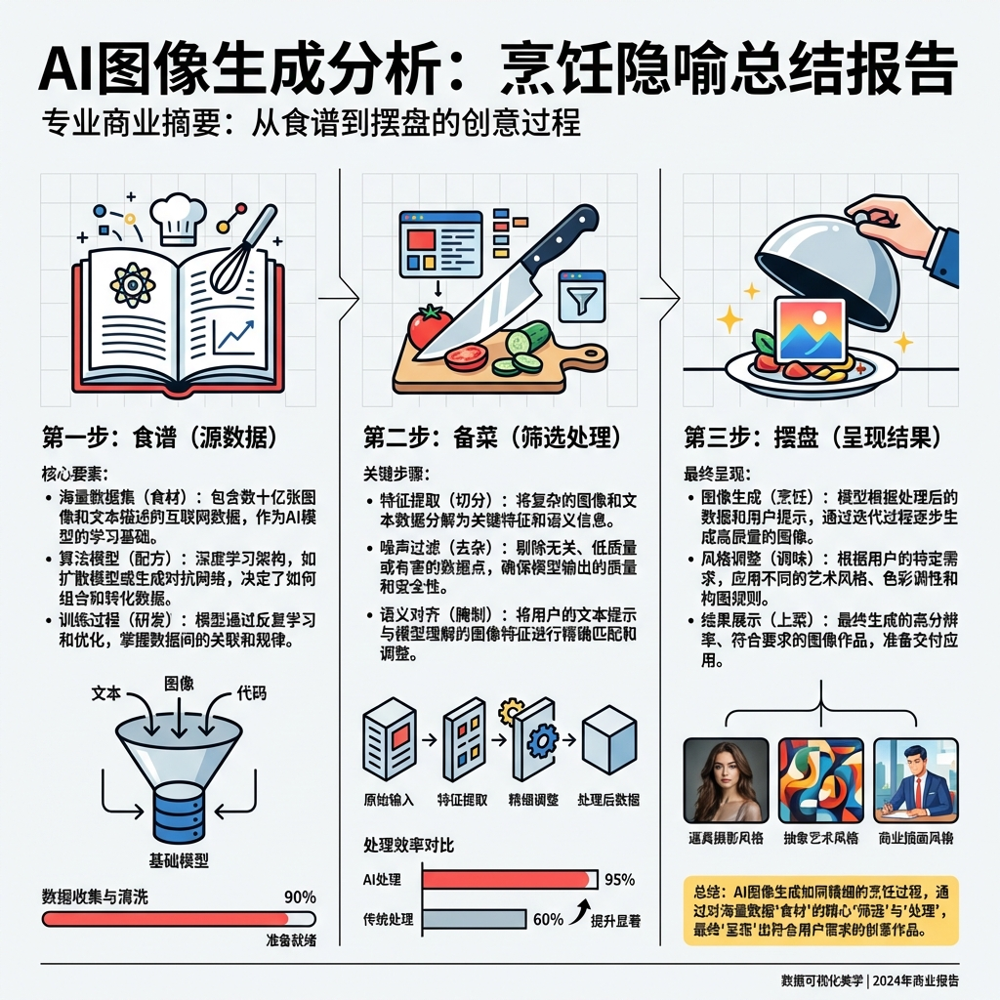

# 每日复盘: 2026-01-19

> 日期: 2026-01-19
> 星期: 周一

## 🌅 今日概览
>
> 透过AI生图的表象，重新审视了“用户决策”的本质。
> 今天不仅是在解决一个具体的技术落地问题（美团AI生图弃用），更是在进行一次思维的“升维”——将原本孤立的图片质量问题，映射为生动的“做菜隐喻”，最终回归到**“辅助决策”**这唯一的北极星指标上。

## 🌟 今日亮点 (Highlights)

- **思维模型升级 (烹饪隐喻)**：
  - 面对复杂的业务问题，成功运用了**隐喻法**进行降维打击：
    - **菜谱 (Recipe)** = 参考图源头 (16:9详情图 vs 1:1列表图)
    - **刀工 (Cutting)** = 信息筛选与提炼 (核心卖点是否突出)
    - **摆盘 (Plating)** = 视觉呈现与焦点 (是否传递有效信息)
  - 这个模型不仅清晰了问题，也为明天的汇报提供了极佳的叙事框架。

- **深度洞察**：
  - 意识到“好看”不等于“好用”。
  - 提出了**场景化分级**的策略：区分强视觉决策（餐饮/美甲）与强信息决策（KTV/按摩），这可能是未来AI生图产品化的破局点。

## 📥 信息输入 (Observe)

- **反面案例学习**：通过分析商户弃用AI生图的真实案例，反向验证了“以用户为中心”的重要性。如果不理解用户在列表页想看什么（价格？距离？场景？），再精美的图也是无效的。

## 🎯 行动记录 (Act)

- [x] 深度分析美团AI生图弃用案例，产出 `projects/AI商品图/2026-01-19-美团AI生图问题分析.md`
- [x] 修正了参考图源头的认知偏差（确认是16:9商品详情图）

## 🤔 反思 (Reflect)

### 做得好的

- **本质思考**：没有陷入“为什么AI画歪了”的技术细节，而是跳出来思考“这张图是给谁看的，用来干什么的”。
- **及时修正**：在意识到参考图源头描述不准确时，立即进行了纠偏，保证了分析的严谨性。

### 可以改进的

- **数据意识**：目前的分析更多基于定性逻辑，未来应更多关注是否有A/B测试的定量数据支持。

## 📝 对上期计划的检查 (Checklist)

- [x] (1.07计划) 用户分析 (从信任感视角重新审视产品) *（已通过今日的生图分析深度实践）*

## 📅 明日计划 (Plan)

- [ ] **待定** (稍后详细沟通)
- [ ] 继续推进AI商品图项目的汇报与落地

---
*Created by AI Assist on 2026-01-20*
