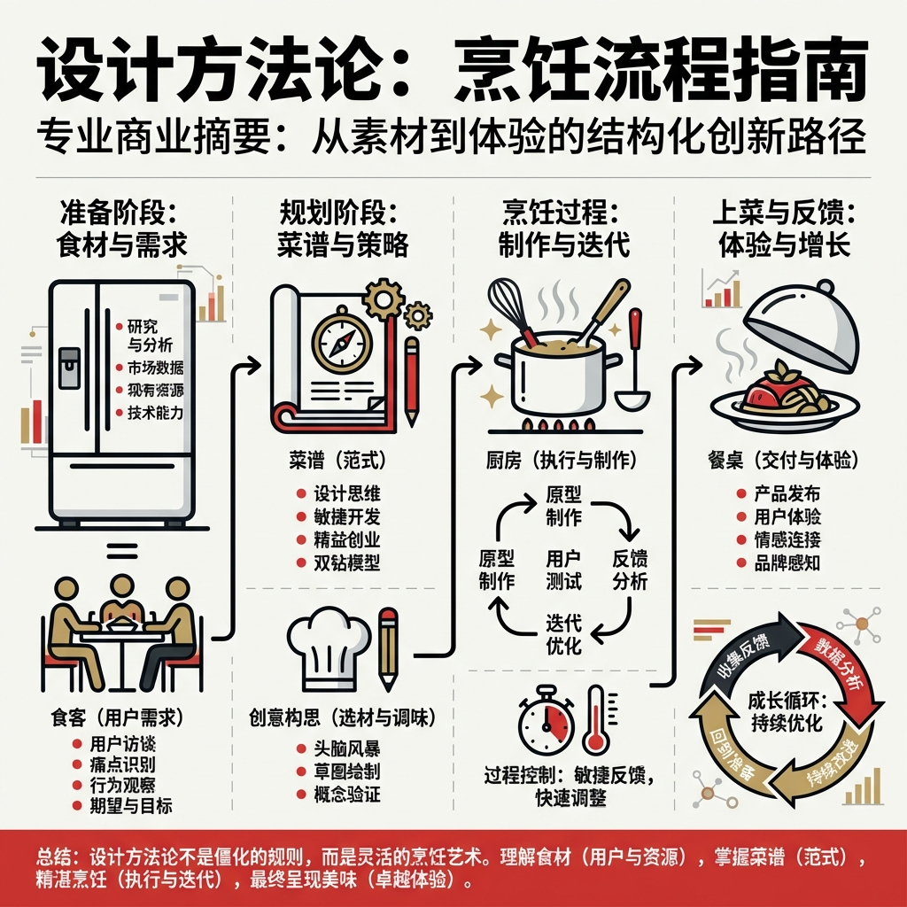

# 每日复盘: 2026-01-21

> 日期: 2026-01-21
> 星期: 周三

## 🌅 今日概览
>
> 深度思考日。
> 将“设计”这一复杂的商业行为，成功解构为一套通俗易懂的“烹饪方法论”。这不仅是话术的升级，更是对设计本质（连接资源与需求）的深刻洞察。

## 🌟 今日亮点 (Highlights)

- **认知跃迁**：
  - 产出了极具分量的知识沉淀：`knowledge/2026-01-21-设计如烹饪-通俗化设计方法论.md`。
  - 确立了设计的**决策顺位**：冰箱(资产) -> 食客(需求) -> 菜谱(范式) -> 厨艺(技法)。这彻底颠覆了以往“先做图后找人”的错误逻辑。
  - **连接者定位**：明确了AI生图现阶段的“学徒”身份，以及未来的终极目标——实现商户、用户、技术的三位一体。

## 📥 信息输入 (Observe)

- **自我对话**：通过不断的反问（“为什么AI画不好？”“商户为什么不用？”），逼出了“烹饪隐喻”这套逻辑闭环。

## 🎯 行动记录 (Act)

- [x] 深度重构设计方法论，完成《设计如烹饪》一文的撰写与归档。
- [x] 成功将个人隐性知识（Intuition）显性化为可传播的显性知识（Methodology）。

## 🤔 反思 (Reflect)

### 做得好的

- **深度复盘**：没有满足于表面的“记录”，而是对内容进行了两次大的重构（从项目文档 -> 个人感悟 -> 逻辑升维），直到找到最本质的逻辑。
- **以终为始**：深刻理解了“食客（用户）”在整个链条中的决定性作用。

### 可以改进的

- （暂无，今日产出质量很高）

## 📝 对上期计划的检查 (Checklist)

- [x] (1.19计划) 继续推进AI商品图项目的汇报与落地 *（已通过今日的方法论梳理，为后续汇报构建了坚实的理论地基）*

## 📅 明日计划 (Plan)

- [ ] **调研设计范式** (重点)
  - 梳理市面上有哪些主流的“菜谱”（设计范式）。
  - 分析这些范式分别适合什么样的“冰箱”（商户类型）和“食客”（用户群体）。
- [ ] 思考如何将这些范式转化为可复用的Prompt模板。

---
*Created by AI Assist on 2026-01-22*
