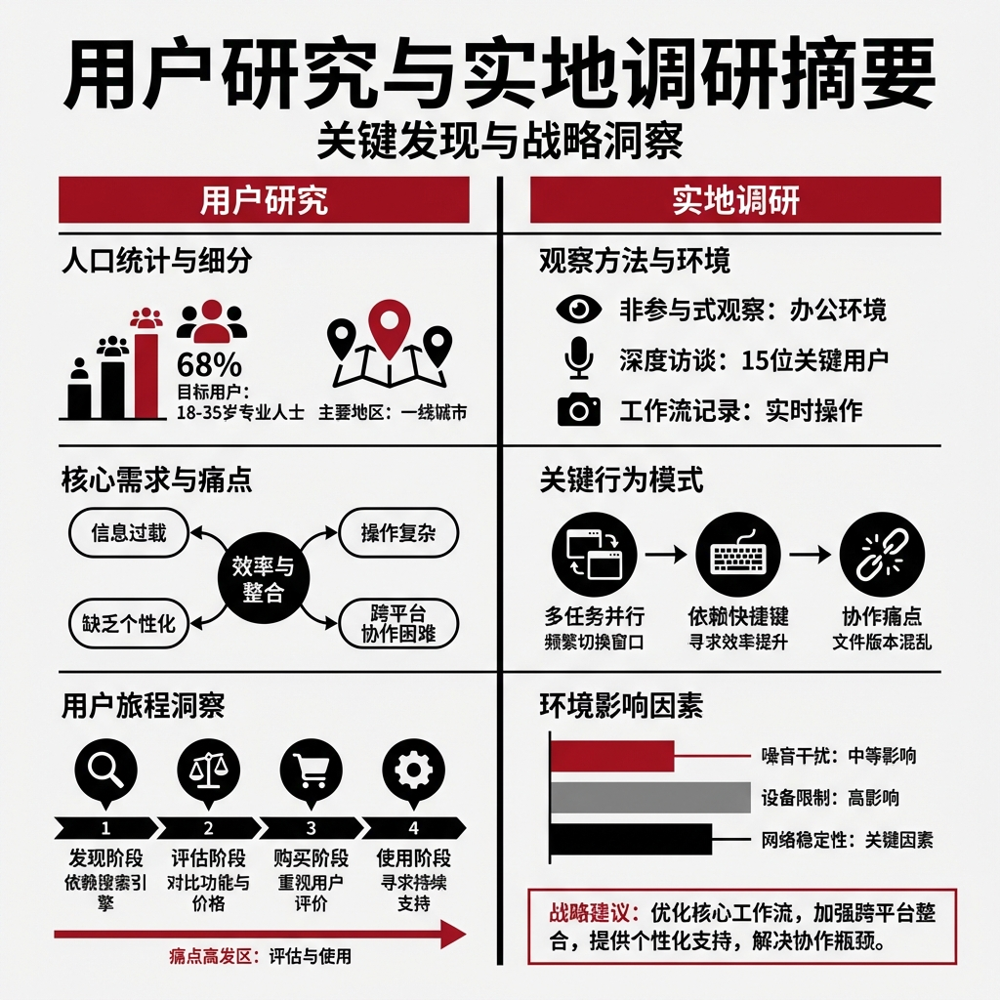

# 每日复盘: 2026-01-22

> 日期: 2026-01-22
> 星期: 周四

## 🌅 今日概览
>
> 深入一线聆听真实的声音。
> 从办公室里的“做菜”理论，走到了田间地头的“听音”现场。如果说昨天是关于设计的宏观方法论搭建，那今天就是对用户微观痛点的具体感知——无论是语言的鸿沟，还是操作的断点，都提醒我们：产品离用户还有多远。

## 🌟 今日亮点 (Highlights)

- **产品洞察**：
  - **语言鸿沟**：通过听音发现，“精英视角”的文案与下沉市场商户的认知存在巨大错位。
  - **流程断点**：识别到“上单任务”中为了免责而牺牲易用性的设计缺陷，提出了“Smart Default (智能预填)”的改良思路。

- **认知闭环**：
  - “设计如烹饪”方法论不仅在小范围得到认可，通过自下而上的传播，开始在团队内建立共同语言。

## 📥 信息输入 (Observe)

- **听音实地感悟**：真实的商户并没有我们想象中那么强的理解力，他们甚至连基本的口语表达都需要客服反复确认。这验证了“极简、通俗”设计的必要性。

## 🎯 行动记录 (Act)

- [x] 完成扬州听音调研第一天，产出 `areas/工作/2026-01-22-扬州听音调研与产品洞察.md`
- [x] 对昨天的方法论传播效果进行了复盘，产出 `projects/AI商品图/2026-01-22-设计方法论传播反馈.md`

## 🤔 反思 (Reflect)

### 做得好的

- **知行合一**：在构建了理论（昨天的方法论）后，立刻投入到一线的实践（今天的听音）中去验证，保持了良好的节奏。
- **理性预期**：对管理层的反馈保持了成熟的心态，不急于求成，关注实质影响力。

### 可以改进的

- **调研深度**：今天的听音更多是发现问题，明天的调研可以尝试带着“假设”去听，比如验证一下“如果给他们推荐图，他们会选哪个”。

## 📝 对上期计划的检查 (Checklist)

- [ ] (1.21计划) 调研设计范式 *（因出差扬州听音，该计划顺延至行程结束后）*
- [x] (1.21计划) 思考转化Prompt模板 *（已在听音过程中结合商户痛点有了初步想法：需要更通俗的Prompt引导）*

## 📅 明日计划 (Plan)

- [ ] **继续听音**
  - 重点关注商户对于“图片”相关的描述和反馈。
- [ ] **调研整理**
  - 汇总两天的听音发现，尝试提炼出 3-5 个具体的产品优化点。

---
*Created by AI Assist on 2026-01-22*
