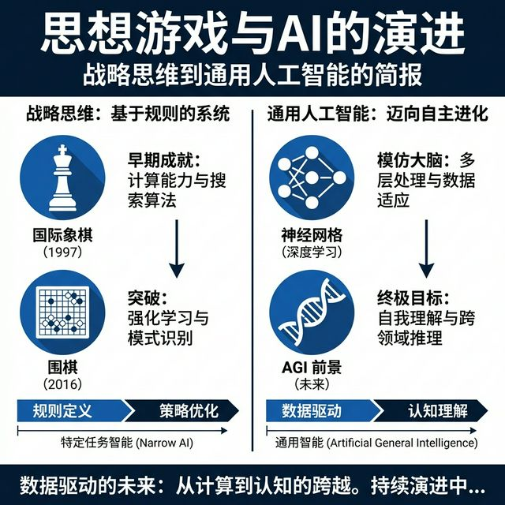

# 每日复盘: 2026-02-13

> 日期: 2026-02-13
> 星期: 周五

## 🌅 今日概览

> **从棋盘走向世界**。
> 今天是被《The Thinking Game》深深触动的一天。见证了从单纯的胜负欲升华为对人类智慧集合的探索，Demis 的远见让人肃然起敬。这也是一次关于 AI 无论是作为技术还是作为社会变革力量的深刻反思。

## 🌟 今日亮点 (Highlights)

- **深度思考**：

  - **纪录片共鸣**：通过《The Thinking Game》重温了 DeepMind 的征程，特别是 Demis 放弃个人胜负追求更伟大目标的转折点，以及“创造亚当”画作与 AI 对话的互文。
  - **角色反思**：重新审视了 AI 产品经理的角色——不再只是技术翻译，更是社会生产关系的设计者和信息分发的博弈者。
- **知识地图扩展**：

  - 明确了下一步的学习方向：系统思维、社会学分工、非对称博弈论。
  - 整理了待读书单：《系统之美》、《技术陷阱》、《策略思维》、《信号与噪声》。

## 📥 信息输入 (Observe)

- **纪录片**：《The Thinking Game》——不仅是技术史，更是思想史。
- **互动讨论**：关于完全信息博弈（围棋/AlphaGo）与非完全信息博弈（星际争霸/AlphaStar/现实商业）的区别与策略。

## 🎯 行动记录 (Act)

- [X] 完成观后感撰写与归档：`areas/学习/2026-02-13-TheThinkingGame观后感.md`
- [X] 整理并添加 4 本核心推荐书目到文档中。

## 🤔 反思 (Reflect)

### 做得好的

- **及时沉淀**：看完片子立刻记录，趁热打铁将感性的触动转化为理性的思考（如博弈论的映射）。
- **关联思考**：没有停留在纪录片本身，而是联系到了自己的职业（AIPM）和现实商业环境（商户困境），这种迁移学习非常有价值。

### 可以改进的

- **行动落地**：思考很有深度，下一步需要将这些理论（如博弈论策略）尝试应用到具体的工作场景中（例如：如何帮助商户在信息不对称中做决策）。

## 📝 对上期计划的检查 (Checklist)

*(上一次复盘是 1月22日，时间跨度较大，计划已失效或需重新评估)*

- [X] (1.22计划) 继续听音
- [X] (1.22计划) 调研整理

## ß📅 明日计划 (Plan)

- [ ] **阅读启动**：从推荐书单中挑选一本（如《系统之美》）开始阅读序章。
- [ ] *(待补充)*

---

*Created by AI Assist on 2026-02-13*
